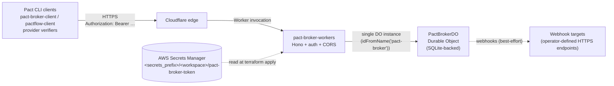

# Pact Broker — Architecture Guide

The broker is a single Cloudflare Worker fronting a single Durable Object.
There is no external database, no Redis, and no separate UI service.
All state — pacticipants, versions, pacts, verifications, environments,
deployments, webhooks — lives in the SQLite engine inside one Durable
Object instance.

The broker speaks the [HAL-style API](https://docs.pact.io/pact_broker/api_docs)
that the canonical `pact-broker-client` and consumer-side Pact tools
expect. Operators run it as a turnkey replacement for the Ruby reference
broker, sized for one team's worth of contract traffic.

## Topology

One Worker. One DO. One SQLite database file inside that DO. Operators
running multiple environments (e.g. `staging` + `production`) get
multiple Workers — each Worker has its own DO namespace, so the
databases are independent.

## Why a Durable Object

Pact's data shape is a graph of pacticipants, versions, pacts, and
verifications, with frequent reads of "the latest pact for consumer X
deployed in environment Y". An external Postgres would solve this fine
but adds an operational dependency. A Durable Object trades the
ergonomics of "I have a real database" for "I have zero infrastructure
to manage" — Cloudflare handles durability, replication, and backups.

The trade-offs to understand:

- **Single-writer.** All requests serialise through one DO. For one
  team's contract traffic this is irrelevant; for thousands of
  publishes/sec it would not be.
- **Storage cap.** DO SQLite tops out at ~10 GB per DO today.
  Operationally that's millions of pacts. If you approach the cap,
  reach for retention/pruning before reaching for a different store.
- **Backups.** No automatic snapshot/export. See `infra/README.md` →
  "Backup considerations" and `docs/INCIDENT-RESPONSE.md` → "DO storage
  recovery".

## Request lifecycle

For every request, in order (see `src/index.ts:1`):

1. **Request ID middleware** — accepts an inbound `X-Request-Id` if it
   matches `^[A-Za-z0-9_-]{1,128}$`, otherwise generates a UUID.
   Echoed back as `X-Request-Id` and threaded through the access log.
2. **Security-headers middleware** — sets the standard
   `X-Content-Type-Options`, `X-Frame-Options`, `Referrer-Policy`, and
   `Permissions-Policy` headers.
3. **Structured access log** — emits one JSON line per request after
   the handler runs. Never logs the `Authorization` header or the
   request body.
4. **Auth middleware** (`src/middleware/auth.ts`) — bearer-token check
   against `PACT_BROKER_TOKEN` using a constant-time compare. If
   `ALLOW_PUBLIC_READ=true` is set, GET / HEAD requests bypass auth.
5. **Route handler** — calls into the DO's stub, which executes the
   underlying SQLite operation. Returns HAL JSON.

The 10 MB body limit (`MAX_BODY_SIZE` in `src/index.ts`) caps published
pact size globally; per-route caps for narrower endpoints live in the
route files.

## API surface

The broker is HAL-compatible with the Ruby Pact Broker. The
`pact-broker-client` CLI works out of the box. Endpoint groups:

| Group              | File                              | What it owns                                                        |
| ------------------ | --------------------------------- | ------------------------------------------------------------------- |
| Index (HAL root)   | `src/routes/index.ts`             | `GET /` — entrypoint that advertises spec version + relations       |
| Pacticipants       | `src/routes/pacticipants.ts`      | Consumers and providers                                             |
| Pacts              | `src/routes/pacts.ts`             | Publish, retrieve by version / tag / branch / latest, content SHA   |
| Verifications      | `src/routes/verifications.ts`     | Provider verification results, `pacts-for-verification`             |
| Matrix             | `src/routes/matrix.ts`            | Compatibility matrix, `can-i-deploy`                                |
| Environments       | `src/routes/environments.ts`      | Environment registry + recorded deployments                         |
| Webhooks           | `src/routes/webhooks.ts`          | Outbound webhook configuration, fired on contract / verification    |
| Badge              | `src/routes/badge.ts`             | SVG matrix badge for embedding in READMEs                           |
| HAL Browser UI     | `src/ui/index.ts`                 | Static HTML at `/ui` for hands-on API exploration                   |

The HAL response builder (`src/services/hal.ts`) is shared across all
route files — every response routes through it for consistent self / up
links and embedded relation shapes.

## Auth model

- One bearer token per Worker, named `PACT_BROKER_TOKEN`.
- Source of truth: AWS Secrets Manager
  (`<secrets_prefix>/<workspace>/pact-broker-token`). Terraform reads
  the secret at apply time and pushes it into the Worker via
  `wrangler secret put`. The token is never in HCL or `wrangler.jsonc`.
- Optional `ALLOW_PUBLIC_READ=true` mode lets unauthenticated GET / HEAD
  through. Useful for read-only badge embedding or shared dashboards.
  Still rejects writes without auth.
- Constant-time compare guards against timing-side-channel token
  recovery (`src/middleware/auth.ts:1`).

## Webhooks

Webhooks (`src/routes/webhooks.ts`) fire best-effort on
`contract_published` and `provider_verification_published` events. The
DO uses `executionCtx.waitUntil` to dispatch the HTTP call after the
publish response is returned, so a slow webhook target never blocks the
client. Three retries with exponential backoff; failures land in the
DO's webhook execution log (queryable via the API).

Webhook targets must be HTTPS. The `body` field can be omitted (broker
sends a default JSON envelope) or templated with handlebars-style
substitutions for the resolved consumer / provider / version.

## Durability and backup posture

- DO SQLite is durable and replicated by Cloudflare. There is no Redis,
  no in-memory state, no startup migration that can corrupt data on a
  crash.
- Schema migrations live in `src/db/migrations.ts`, executed at DO
  cold-start. New rows are added; columns are added with `ALTER`; data
  loss is never part of a migration. Old DO instances pick up new
  migrations on their next request.
- **There is no automated snapshot/export.** Operators who want
  point-in-time recovery should periodically dump via the API
  (`pact-broker-client` has dump/import commands) or via a custom
  worker invocation that streams the DO contents to R2 / S3.
  See `infra/README.md` → "Backup considerations".

## Where to look

| Concern                                 | File                                              |
| --------------------------------------- | ------------------------------------------------- |
| Hono app + middleware wiring            | `src/index.ts`                                    |
| Durable Object class                    | `src/durable-objects/pact-broker.ts`              |
| SQLite schema                           | `src/db/schema.ts`                                |
| Schema migrations                       | `src/db/migrations.ts`                            |
| Auth (bearer token + public-read)       | `src/middleware/auth.ts`                          |
| HAL response builder                    | `src/services/hal.ts`                             |
| Input validation (Zod schemas)          | `src/lib/validation.ts`                           |
| HAL Browser UI (static HTML)            | `src/ui/index.ts`                                 |
| Worker config template (rendered)       | `wrangler.jsonc.tmpl`                             |
| Infra (Terraform)                       | `infra/` — see [`infra/README.md`](../infra/README.md) |
| CI / CD pipeline                        | [`docs/CICD.md`](CICD.md)                         |
